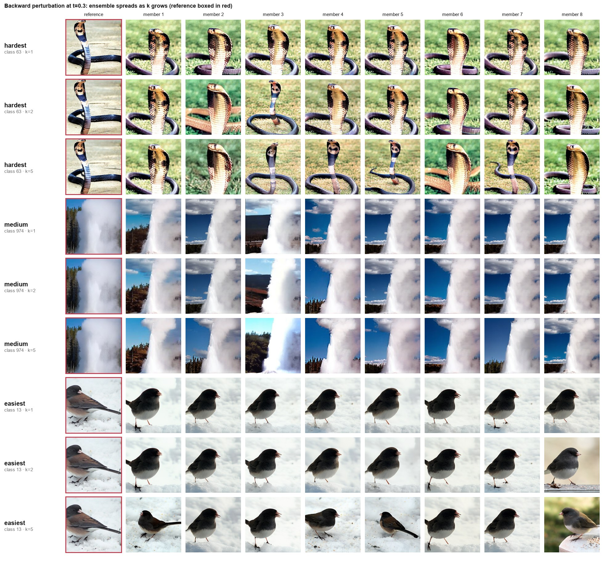
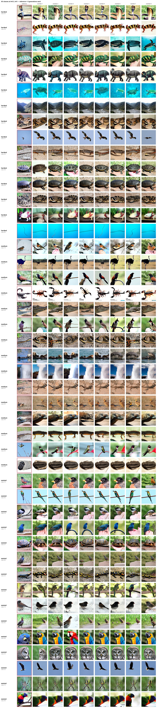
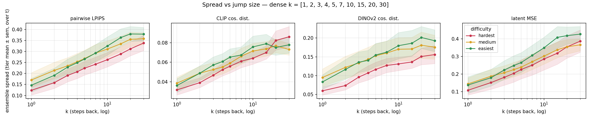
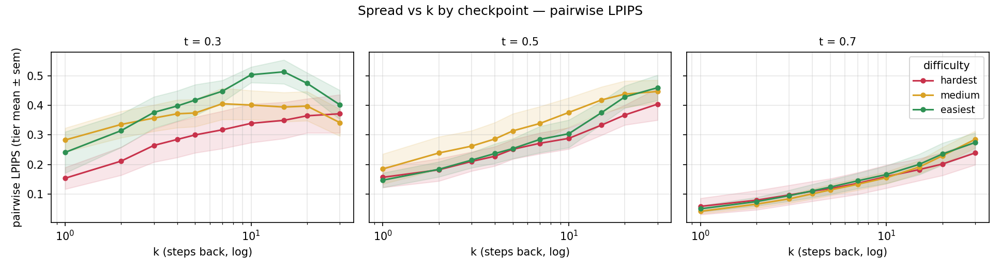

# Результаты: масштабирование на 45 классов + геометрические возмущения

Два прогона на предобученном DiT-XL/2 (250 шагов, CFG=4.0, seed траектории 0):

1. **Backward-возмущение по 45 классам**, разбитым на 3 тира сложности по KID (hardest / medium / easiest, по 15). Облегчённый конфиг: ансамбль M=8, чекпоинты t ∈ {0.3, 0.5, 0.7}, k ∈ {1, 2, 5}.
2. **Геометрические возмущения латента** (поворот / сдвиг / масштаб / отражение / shear) на тех же 45 классах, в двух режимах: детерминированный свип по величине и ансамбль случайных трансформаций.

---

## Часть 1. Зависит ли неопределённость от сложности класса?

**Короткий ответ: нет.** Это главный (и отрицательный) результат прогона.


Разброс ансамбля на самом чувствительном чекпоинте (t=0.3, k=5) против per-class KID, цвет = тир. Линии тренда почти горизонтальны. Spearman ρ = +0.07 (LPIPS), +0.21 (CLIP), +0.23 (DINO), +0.06 (latent MSE) — корреляции нет.*

Ранее в отчёте по 2 классам была «находка»: тяжёлые классы дают больший разброс. На 45 классах она **не воспроизвелась** — держалась на одной паре собака/попугай и оказалась артефактом маленькой выборки.


*Разброс vs позиция на траектории (9 чекпоинтов, ± sem по классам), k=5. Форма — немонотонный **горб с максимумом на t≈0.3–0.4**, воспроизводится на всех тирах; порядок тиров по сложности НЕ монотонный.*

> **Правка (плотный t).** Изначально этот график строился по 3 чекпоинтам {0.3, 0.5, 0.7} и выглядел монотонно падающим. Догон по 9 чекпоинтам {0.1…0.9} показал, что это лишь **правый, спадающий склон горба**: разброс сначала *растёт* от t=0.1 к пику на t≈0.3–0.4, и только потом падает к t=0.9. Максимум неопределённости — в начале-середине траектории, а не в самом начале (при t=0.1 латент ещё почти чистый шум — расходиться некуда; при t=0.9 картинка уже собрана). Форма устойчива по k, высота пика растёт с k (LPIPS: k=1 → ~0.26, k=5 → ~0.42, k=20 → ~0.51). См. `tier_spread_vs_t_k{1,2,5,10,20}.png`.

Средний разброс по тирам на спадающем склоне (perturb, k=5, LPIPS, прогон по 45 классам):

| тир | t=0.3 | t=0.5 | t=0.7 |
|---|---|---|---|
| hardest | 0.337 | 0.268 | 0.114 |
| **medium** | **0.416** | **0.295** | **0.120** |
| easiest | 0.349 | 0.240 | 0.095 |

Выше всех идёт **medium**, а не hardest. Если бы неопределённость росла со сложностью, порядок был бы hardest > medium > easiest — этого нет.

**Что воспроизвелось надёжно** (согласуется с прогоном по 2 классам):
- Зависимость разброса от позиции на траектории — **горб с пиком на t≈0.3–0.4**, единый по всем тирам (прежняя формулировка «монотонно падает» была артефактом трёх чекпоинтов на спадающем склоне).
- Разброс монотонно растёт с k (см. `tier_spread_vs_k.png`).

---

## Часть 2. Геометрические возмущения латента


 Свип по углу поворота, усреднение по тиру. Отклонение итога от неискажённого reference растёт с углом; тождество (0°) ровно в нуле. Правая панель — эквивариантный остаток.*

**Латентная геометрия НЕ эквивариантна.** Эквивариантный остаток `LPIPS(final(T(x)), T(final(x)))` при повороте на 45° = 0.48–0.53 по всем тирам. То есть поворот латента даёт не повёрнутую картинку, а **семантически другую** — геометрический сдвиг латента работает как семантическое возмущение. Это подтвердилось на всех 45 классах.


*LPIPS-отклонение от reference при максимальной величине каждой трансформации, по тирам. По тирам различий почти нет.*

Насколько сильно каждая трансформация двигает изображение (LPIPS к reference на макс. величине, среднее по 45 классам):

| трансформация | LPIPS |
|---|---|
| scaling | 0.537 |
| rotation | 0.491 |
| flip | 0.472 |
| translation | 0.458 |
| shear | 0.318 |

Масштаб/поворот/отражение/сдвиг примерно на одном уровне, shear заметно слабее.

**Ансамблевый режим ведёт себя корректно** — разброс растёт с уровнем случайности (поворот, LPIPS): level ±10° → 0.244, ±20° → 0.340, ±30° → 0.401.


*Разброс ансамбля случайных сдвигов латента vs уровень возмущения, по тирам.*

---

## Часть 3. Плотный свип по k + генерации на фото

Догоняющий прогон по двум просьбам ревьюера: (1) показать разброс не числами, а на реальных генерациях; (2) уплотнить сетку k — было {1, 2, 5}, стало **{1, 2, 3, 4, 5, 7, 10, 15, 20, 30}**. Подвыборка 15 классов (5 на тир), те же сиды / чекпоинты / ансамбль M=8. Точки k ∈ {1, 2, 5} воспроизводят числа основного прогона точно, так что новая кривая непрерывна со старыми тремя точками.

### Как это выглядит на генерациях


*t=0.3, по одному классу на тир, строки k=1/2/5, референс в красной рамке. При k=1 члены ансамбля почти неотличимы от референса; к k=5 меняются поза и композиция (кобра иначе свёрнута, у гейзера другая струя и небо, юнко разворачивается).*


*все классы при t=0.3, k=5 (референс + 8 генераций на класс), сгруппированы по тирам. Разброс на глаз сопоставим по всем тирам — «сложность класса» визуально не выделяется.*

Полные полосы по всему диапазону k на класс — `images/photo_densek_{hardest,medium,easiest}.jpg`; три тира бок о бок при t=0.3, k=5 — `images/photo_tier_compare.jpg`.

### Кривая разброса от k


*разброс vs k (лог-ось), усреднение по t и классам тира. На лог-оси почти прямая → spread ∝ log k. Старые точки {1, 2, 5} лежат на той же кривой.*

Но усреднение по t прячет главное — разбивка по чекпоинтам:


*тот же разброс (LPIPS), отдельно по чекпоинтам. На t=0.3 кривая выходит на плато и **разворачивается**; на t=0.5 ещё растёт во всём диапазоне; на t=0.7 все тиры схлопнуты и почти плоски.*

Разворот на t=0.3 (LPIPS, среднее по классам тира):

| k | hardest | medium | easiest |
|---|---|---|---|
| 5 | 0.300 | 0.374 | 0.418 |
| 10 | 0.339 | 0.401 | 0.503 |
| 15 | 0.349 | 0.394 | **0.513** |
| 20 | 0.365 | 0.397 | 0.474 |
| 30 | 0.371 | 0.342 | 0.402 |

easiest пикует к k≈15 и падает к k=30; medium разворачивается ещё раньше (пик ~k=7). Причина: при малом t откат на большой k уводит латент почти в чистый шум — ансамбль «забывает» референс и сходится к типичным сэмплам класса, разброс упирается в потолок и дальше даже спадает. Прежняя сетка {1, 2, 5} обрывалась **до** пика, поэтому кривая казалась чисто монотонной.

По тирам: hardest стабильно **ниже** всех, easiest/medium выше — если что-то и есть, это слабая *обратная* связь со сложностью, а не «сложнее → неопределённее». Главный вывод Части 1 держится.

---

## Выводы

1. **Backward-неопределённость не отражает сложность класса по KID** (ρ ≈ 0, порядок тиров не монотонный). Прежняя «находка» по 2 классам не подтвердилась на масштабе.
2. **Зависимость от позиции на траектории — немонотонный горб** с максимумом на t≈0.3–0.4 (по 9 чекпоинтам), единый по всем тирам. Прежний вывод «монотонно падает» был артефактом трёх чекпоинтов на спадающем склоне. Это про механику денойзинга, а не про класс.
3. **Плотный k выявил насыщение и разворот на раннем чекпоинте**: на t=0.3 разброс пикует к k≈10–15 и спадает к k=30 (латент уходит в шум); на t=0.5 ещё растёт, на t=0.7 плоский. На грубой сетке {1, 2, 5} этого не было видно.
4. **Геометрические трансформации латента не эквивариантны** — действуют как семантические возмущения, а не как геометрия изображения. Устойчиво по всем классам.
5. **Сложность класса не влияет и на геометрический отклик** — различия между тирами в пределах шума.

## Оговорки

- KID по оси X **приблизительный** (снят с `images_classes/kid_difficulty_tiers.png`). Корреляция настолько близка к нулю, что точные значения её не изменят, но для строгой формулировки лучше подставить настоящие числа.
- Облегчённый конфиг: M=8. Тир-прогон — 3 чекпоинта {0.3, 0.5, 0.7} по 45 классам; догон по t — 9 чекпоинтов {0.1…0.9} на подвыборке 15 классов (5 на тир). По одной траектории на класс (seed 0) — есть ± sem *по классам внутри тира*, но нет усреднения по нескольким траекториям на класс.
- Геометрия: только padding=reflection; поведение у зануления краёв (zeros) может отличаться.

## Как воспроизвести

```bash
python experiments/amir/exp1_renoise.py --classes <45 из config.yaml> \
    --ensemble 8 --t-fracs 0.3 0.5 0.7 --outdir outputs/exp1_tiers
python experiments/amir/plot_tiers.py --results outputs/exp1_tiers/exp1_results.csv

python experiments/amir/exp_geom.py --all-classes
python experiments/amir/plot_geom.py

# Часть 3 — плотный k + фотопанели (15 классов, 5 на тир)
python experiments/amir/exp1_densek.py --outdir outputs/exp1_densek
python experiments/amir/plot_densek.py
python experiments/amir/build_photo_panels.py

# Плотный t для графиков spread-vs-t (k = 1,2,5,10,20; 9 чекпоинтов)
python experiments/amir/exp1_densek.py --ks 1 2 5 10 20 \
    --t-fracs 0.1 0.2 0.3 0.4 0.5 0.6 0.7 0.8 0.9 --outdir outputs/exp1_denset
python experiments/amir/plot_denset.py --results outputs/exp1_denset/exp1_densek.csv
```

Настройки зафиксированы в `experiments/amir/config.yaml`. Данные: `exp1_results.csv` (540 строк), `geom_results.csv` (4995 строк), `exp1_densek.csv` (450 строк) и `exp1_denset/exp1_densek.csv` (675 строк). Шаги запуска Части 3 — в `experiments/amir/RUN_DENSEK.md`.
