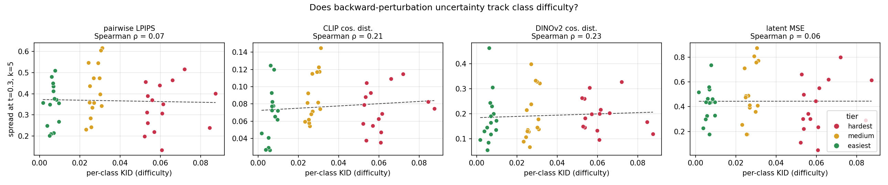
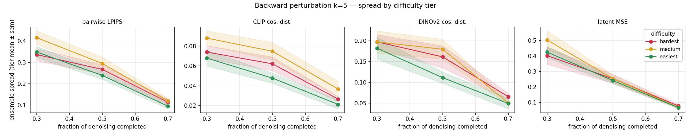
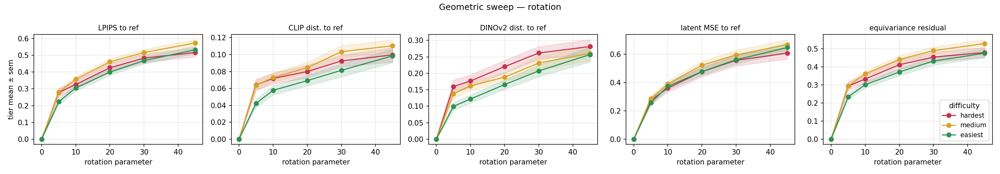
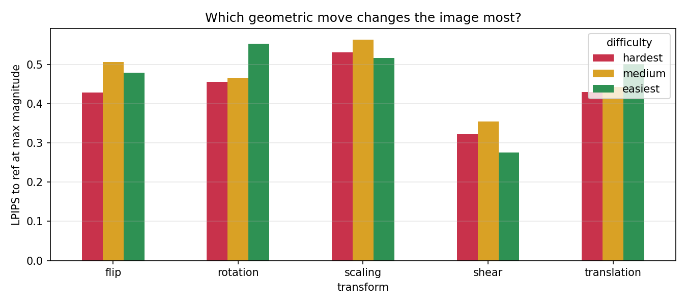
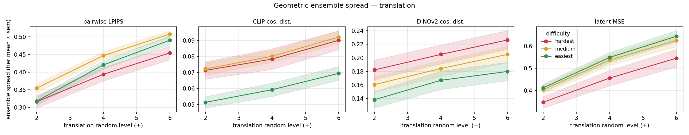

# Результаты: масштабирование на 45 классов + геометрические возмущения

Два прогона на предобученном DiT-XL/2 (250 шагов, CFG=4.0, seed траектории 0):

1. **Backward-возмущение по 45 классам**, разбитым на 3 тира сложности по KID (hardest / medium / easiest, по 15). Облегчённый конфиг: ансамбль M=8, чекпоинты t ∈ {0.3, 0.5, 0.7}, k ∈ {1, 2, 5}.
2. **Геометрические возмущения латента** (поворот / сдвиг / масштаб / отражение / shear) на тех же 45 классах, в двух режимах: детерминированный свип по величине и ансамбль случайных трансформаций.

---

## Часть 1. Зависит ли неопределённость от сложности класса?

**Короткий ответ: нет.** Это главный (и отрицательный) результат прогона.


*Подпись: Разброс ансамбля на самом чувствительном чекпоинте (t=0.3, k=5) против per-class KID, цвет = тир. Линии тренда почти горизонтальны. Spearman ρ = +0.07 (LPIPS), +0.21 (CLIP), +0.23 (DINO), +0.06 (latent MSE) — корреляции нет.*

Ранее в отчёте по 2 классам была «находка»: тяжёлые классы дают больший разброс. На 45 классах она **не воспроизвелась** — держалась на одной паре собака/попугай и оказалась артефактом маленькой выборки.


*Подпись: Разброс vs позиция на траектории, усреднение по тиру (± sem по классам), k=5. Форма (спад с прогрессом денойзинга) воспроизводится на всех тирах, но порядок тиров НЕ монотонный по сложности.*

Средний разброс по тирам (perturb, k=5, LPIPS):

| тир | t=0.3 | t=0.5 | t=0.7 |
|---|---|---|---|
| hardest | 0.337 | 0.268 | 0.114 |
| **medium** | **0.416** | **0.295** | **0.120** |
| easiest | 0.349 | 0.240 | 0.095 |

Выше всех идёт **medium**, а не hardest. Если бы неопределённость росла со сложностью, порядок был бы hardest > medium > easiest — этого нет.

**Что воспроизвелось надёжно** (согласуется с прогоном по 2 классам):
- Разброс монотонно падает с прогрессом денойзинга на всех тирах.
- Разброс монотонно растёт с k (см. `tier_spread_vs_k.png`).

---

## Часть 2. Геометрические возмущения латента


*Подпись: Свип по углу поворота, усреднение по тиру. Отклонение итога от неискажённого reference растёт с углом; тождество (0°) ровно в нуле. Правая панель — эквивариантный остаток.*

**Латентная геометрия НЕ эквивариантна.** Эквивариантный остаток `LPIPS(final(T(x)), T(final(x)))` при повороте на 45° = 0.48–0.53 по всем тирам. То есть поворот латента даёт не повёрнутую картинку, а **семантически другую** — геометрический сдвиг латента работает как семантическое возмущение. Это подтвердилось на всех 45 классах.


*Подпись: LPIPS-отклонение от reference при максимальной величине каждой трансформации, по тирам. По тирам различий почти нет.*

Насколько сильно каждая трансформация двигает изображение (LPIPS к reference на макс. величине, среднее по 45 классам):

| трансформация | LPIPS |
|---|---|
| scaling | 0.537 |
| rotation | 0.491 |
| flip | 0.472 |
| translation | 0.458 |
| shear | 0.318 |

Масштаб/поворот/отражение/сдвиг примерно на одном уровне, shear заметно слабее.

**Ансамблевый режим ведёт себя корректно** — разброс растёт с уровнем случайности (поворот, LPIPS): level ±10° → 0.244, ±20° → 0.340, ±30° → 0.401.


*Подпись: Разброс ансамбля случайных сдвигов латента vs уровень возмущения, по тирам.*

---

## Выводы

1. **Backward-неопределённость не отражает сложность класса по KID** (ρ ≈ 0, порядок тиров не монотонный). Прежняя «находка» по 2 классам не подтвердилась на масштабе.
2. **Форма зависимости от позиции на траектории и от k устойчива** и не зависит от тира — это про механику денойзинга, а не про класс.
3. **Геометрические трансформации латента не эквивариантны** — действуют как семантические возмущения, а не как геометрия изображения. Устойчиво по всем классам.
4. **Сложность класса не влияет и на геометрический отклик** — различия между тирами в пределах шума.

## Оговорки

- KID по оси X **приблизительный** (снят с `images_classes/kid_difficulty_tiers.png`). Корреляция настолько близка к нулю, что точные значения её не изменят, но для строгой формулировки лучше подставить настоящие числа.
- Облегчённый конфиг: M=8, 3 чекпоинта. По одной траектории на класс (seed 0) — есть ± sem *по классам внутри тира*, но нет усреднения по нескольким траекториям на класс.
- Геометрия: только padding=reflection; поведение у зануления краёв (zeros) может отличаться.

## Как воспроизвести

```bash
python experiments/amir/exp1_renoise.py --classes <45 из config.yaml> \
    --ensemble 8 --t-fracs 0.3 0.5 0.7 --outdir outputs/exp1_tiers
python experiments/amir/plot_tiers.py --results outputs/exp1_tiers/exp1_results.csv

python experiments/amir/exp_geom.py --all-classes
python experiments/amir/plot_geom.py
```

Настройки зафиксированы в `experiments/amir/config.yaml`. Данные: `exp1_results.csv` (540 строк) и `geom_results.csv` (4995 строк).